# 🤖 Awesome Autonomous Mobile Robot (AMR) Management

  
  
  
  
  
  

> **A curated, SEO-optimized list of top commercial SaaS platforms and open-source projects for Autonomous Mobile Robot (AMR) Management, Fleet Orchestration, Multi-Robot Traffic Control, Warehouse Automation, ROS 2, and Open-RMF.**

---

## 📑 Table of Contents

- [📊 Sector Overview & Market Size](#-sector-overview--market-size)
- [🏢 SaaS & Commercial AMR Management Platforms](#-saas--commercial-amr-management-platforms)
- [💻 Open-Source Repositories & Frameworks](#-open-source-repositories--frameworks)
- [🛠️ Key Standards & Protocols](#️-key-standards--protocols)
- [🤝 How to Contribute](#-how-to-contribute)
- [📈 Star History](#-star-history)
- [☕ Support & Acknowledgments](#-support--acknowledgments)
- [⚠️ Disclaimer](#️-disclaimer)

---

## 📊 Sector Overview & Market Size

> **📈 Estimated Sector Market Size:**  
> The global **Autonomous Mobile Robot (AMR) & Fleet Management Software Market** is valued at **~$4.8 Billion USD in 2026** and is projected to expand to **~$14.2 Billion USD by 2032**, reflecting a Compound Annual Growth Rate (CAGR) of **~19.5%**.

> **🧩 Market Structure & Concentration:**  
> The AMR fleet management sector is **highly fragmented**. It consists of three primary ecosystem segments:
> 1. **OEM-Bundled Fleet Managers**: Proprietary software systems tightly integrated with specific AMR hardware (e.g., MiR, OTTO, Locus Robotics, Geek+).
> 2. **Vendor-Agnostic SaaS Orchestrators**: Cloud-based RobOps platforms connecting heterogeneous fleets across multiple vendors and WMS/MES systems (e.g., InOrbit, Formant, SVT Robotics).
> 3. **Open-Source Middleware & Standards**: Community-driven frameworks (Open-RMF, ROS 2 Nav2, VDA 5050) providing standardized traffic deconfliction and fleet interoperability.

---

## 🏢 SaaS & Commercial AMR Management Platforms

Below is a detailed comparison of top commercial enterprise platforms for fleet orchestration, task dispatch, WMS/ERP integration, and telemetry.

*Table sorted by **Company Scale / Valuation / Revenue** in descending order:*

| 🏢 Platform / Company | 💡 Core Capabilities & Focus | 💰 Pricing (Starting Tier) | 🎁 Free Tier / Trial Limit | 📊 Company Scale / Valuation / Revenue |
| :--- | :--- | :--- | :--- | :--- |
| **[OTTO Motors / Rockwell](https://ottomotors.com/)** | Heavy-payload industrial AMR fleet management, enterprise material handling, & WMS integration. | **$1,200 / robot / month** *(Base RaaS software subscription)* | **30-Day Enterprise Pilot** *(Qualified facility trial)* | **~$33 Billion USD** *(Parent Rockwell Automation Market Cap)* |
| **[MiR Fleet / Teradyne](https://www.mobile-industrial-robots.com/)** | Multi-robot traffic control, mission programming, & map sharing for MiR AMR fleets. | **$1,500 / robot / month** *(Or $25,000 unit base license)* | **30-Day Software Simulation Trial** *(Virtual fleet testing)* | **~$22 Billion USD** *(Parent Teradyne Market Cap; MiR Rev ~$75M+)* |
| **[Geek+ RMS](https://www.geekplus.com/)** | Large-scale goods-to-person (G2P), sorting, & automated storage fleet management system (RMS). | **$1,000,000 minimum** *(Turnkey enterprise deployment package)* | **30-Day On-Site Pilot** *(With digital-twin simulation)* | **~$2.34 Billion USD** *(HKEX: 2590 Market Cap; Rev ~$441M)* |
| **[Exotec Deepsky](https://www.exotec.com/)** | Warehouse orchestration software coordinating Skypod 3D climbing AMRs & conveyor systems. | **$2,500 / robot / month** *(RaaS / CapEx modular model)* | **14-Day Digital Twin Simulation** *(Planning phase trial)* | **~$2.0 Billion USD** *(Valuation; Annual Rev ~$330M)* |
| **[LocusOne / Locus Robotics](https://locusrobotics.com/)** | Multi-bot fulfillment orchestration, dynamic routing, & picking optimization for ecommerce/3PL. | **$1,500 / robot / month** *(RaaS operational model)* | **30-Day Enterprise Pilot** *(Customer site demonstration)* | **~$1.4 Billion USD** *(Valuation; ARR ~$100M+)* |
| **[Vecna Robotics](https://www.vecnarobotics.com/)** | Pivotal™ orchestrator for autonomous tuggers, pallet trucks, & high-capacity AMRs. | **$10 / hour per robot** *(~$1,600 / robot / month RaaS)* | **30-Day ROI Pilot Program** *(On-site workflow evaluation)* | **~$900 Million USD** *(Valuation; Annual Rev ~$35M)* |
| **[Brain Corp (BrainOS)](https://www.braincorp.com/)** | AI robotics software platform powering autonomous floor scrubbers & inventory delivery AMRs. | **$500 / robot / month** *(OEM partner SaaS licensing)* | **30-Day OEM Partner Trial** *(Software integration test)* | **~$464 Million USD** *(Valuation; Annual Rev ~$45M)* |
| **[Seegrid Supervisor](https://seegrid.com/)** | Fleet management for vision-guided automated guided vehicles (AGVs) & AMRs. | **$2,000 / robot / month** *(Subscription / RaaS pricing)* | **30-Day Facility Assessment** *(On-site pilot trial)* | **~$400 Million USD** *(Valuation; Annual Rev ~$40M)* | **[SVT Robotics (SOFTBOT)](https://www.svtrobotics.com/)** | SOFTBOT® Platform for rapid drag-and-drop integration between WMS/MES & AMR fleets. | **$2,500 / month / facility** *(Platform integration SaaS)* | **14-Day Developer Sandbox** *(API test drive & simulator)* | **~$100 Million USD** *(Valuation; Annual Rev ~$9.5M)* |
| **[Formant](https://formant.io/)** | Cloud RobOps platform providing teleoperation, data ingest, fleet monitoring, & ROS integrations. | **$100 / robot / month** *(Enterprise Tier starting price)* | **Free Forever Tier up to 2 Robots** *(Basic telemetry & control)* | **~$45 Million USD** *(Total VC Funding Raised; Rev ~$5M)* |
| **[InOrbit](https://www.inorbit.ai/)** | Vendor-agnostic cloud RobOps platform for heterogeneous AMR fleet monitoring & control. | **$50 / robot / month** *(Standard Tier starting price)* | **Free Forever Edition for Unlimited Robots** *(Basic monitoring)* | **~$10 Million USD** *(Series A Funding; ARR ~$1.7M)* |

---

## 💻 Open-Source Repositories & Frameworks

The open-source AMR ecosystem centers on **ROS 2**, **Nav2**, **Open-RMF**, and mapping algorithms. These projects enable building custom fleet management, multi-robot traffic deconfliction, and autonomous navigation systems.

*Table sorted by **GitHub Stars_Count** in descending order:*

| 📦 Repository & Link | ⭐ Stars_Count | 💡 Description & AMR Application |
| :--- | :--- | :--- |
| **[PythonRobotics](https://github.com/AtsushiSakai/PythonRobotics)** |  | Python code collection of autonomous navigation, path planning, SLAM, & obstacle avoidance algorithms for AMRs. |
| **[Google Cartographer](https://github.com/cartographer-project/cartographer)** |  | Real-time 2D & 3D SLAM system providing sensor fusion across lidars & IMUs for mobile robot mapping. |
| **[ROS 2 Core](https://github.com/ros2/ros2)** |  | Core Robot Operating System 2 repository—the global standard middleware for modern AMR software stacks. |
| **[Nav2 (Navigation 2)](https://github.com/ros-navigation/navigation2)** |  | Production-grade open navigation stack for ROS 2—planning, behavior trees, control, and collision avoidance. |
| **[SLAM Toolbox](https://github.com/SteveMacenski/slam_toolbox)** |  | Advanced 2D SLAM and map management package widely deployed in commercial ROS 2 AMRs. |
| **[Gazebo / Ignition Sim](https://github.com/gazebosim/gz-sim)** |  | Open-source multi-robot physics simulator for testing AMR fleets in simulated warehouse environments. |
| **[Micro-ROS Setup](https://github.com/micro-ROS/micro_ros_setup)** |  | Framework bringing ROS 2 directly to microcontrollers in AMR motor drivers, sensors, and actuators. |
| **[Open-RMF Core](https://github.com/open-rmf/rmf)** |  | Open Robotics Middleware Framework—the flagship open system for multi-fleet traffic deconfliction & task allocation. |
| **[free_fleet](https://github.com/open-rmf/free_fleet)** |  | Open-source fleet adapter bridging Nav2-powered mobile robots into Open-RMF fleet management. |
| **[Warehouse AMR ROS 2](https://github.com/Pouya-Mansournia/warehouse-amr-ros2)** |  | Reference simulation stack demonstrating multi-robot warehouse navigation, charging stations, and ROS 2 task dispatch. |

---

## 🛠️ Key Standards & Protocols

- 📜 **[VDA 5050 Standard](https://github.com/VDA5050/VDA5050)**: Standardized MQTT interface protocol connecting AGV/AMR fleets with master control software regardless of manufacturer.
- 🌐 **[Open-RMF Interfaces](https://github.com/open-rmf/rmf_internal_msgs)**: Open messages and APIs for door, lift, workcell, and multi-fleet traffic coordination.
- 🔌 **[ROS 2 Action & Service APIs](https://docs.ros.org/en/rolling/Concepts/Basic/About-Interfaces.html)**: Asynchronous communication interfaces for task execution and robot lifecycle management.

---

## 🤝 How to Contribute

Contributions are highly appreciated! To submit a new SaaS platform or open-source project:

1. **Fork** the repository.
2. Edit `README.md` and add your entry in the appropriate table (maintain alphabetical or designated metric sorting).
3. Include accurate details: Name, Link, Core Capabilities, Pricing / Stars, and Company Scale.
4. Submit a **Pull Request** with a brief summary of additions.

For list guidelines, see [Awesome-Awesome-Awesome](https://github.com/ishandutta2007/Awesome-Awesome-Awesome).

---

## 📈 Star History

---

## ☕ Support & Acknowledgments

Thank you for exploring and supporting **Awesome Autonomous Mobile Robot Management**! 💖

If you find this repository helpful for your robotics research, warehouse automation projects, or software deployments:
- ⭐ **Star** this repository to help others discover it.
- 🔀 **Fork** and share it with fellow robotics engineers.
- 💡 **Open an issue or PR** to keep information updated.

  

---

## ⚠️ Disclaimer

- This is a **community-curated list** intended for informational and research purposes only.
- AMR fleets operate in proximity to facility personnel and infrastructure. Operating robotic systems requires rigorous risk assessment, adherence to safety standards (e.g., ISO 3691-4, ANSI/RIA R15.08), and physical validation before industrial deployment.
